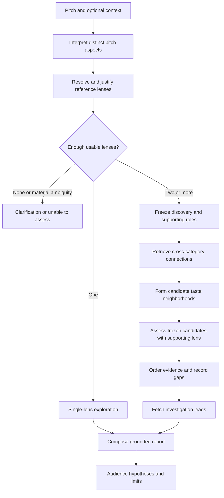

# Audience-discovery pipeline: proposed v2

Date: 2026-10-10

**Status: design proposal, not implemented.** This replaces the pipeline's reasoning model, not the product's purpose. `product-spec.md` remains the source of truth until the spec changes listed below are adopted. The existing implementation and `build-plan.md` describe v1; no application code is changed by this proposal.

## 1. Product contract

A creator provides an idea. Whitespace returns plausible audiences worth testing, the taste connections supporting each suggestion, and concrete leads for investigating how to reach them.

Preserve the goals and limits in spec §§1–4: actionable audience hypotheses, checkable evidence, honest missing-data handling, no personal profiles, no headcounts, no prediction of success, and no claim that a market is unserved.

The question changes from **“Which of the LLM's preselected audiences gets the highest tag score?”** to **“What taste connections can we find around the idea's distinct aspects, and which audience hypotheses do those connections support?”**

A taste neighborhood is a pattern among returned cultural entities. It is not a measured community of people. An audience hypothesis is our interpretation of that pattern; Qloo does not directly validate demand for the new pitch.

## 2. What changes from v1

| V1 mechanism | V2 decision |
|---|---|
| Separate “Suggest with AI” action before a meaningful run | Analyze the pitch automatically inside the server workflow |
| Four to six flat, genre-led words | Preserve distinct aspects, direct excerpts, negation, and constraints |
| Similar-title hypothesis plus LLM-invented rivals | Discover candidate neighborhoods from returned entities and metadata |
| Creator confirms names before Qloo identifies the actual works | Show resolved works and why each was selected; expose ambiguity |
| Mandatory pitch-word-to-tag matching | Reference entities are the initial bridge; tags are optional returned metadata |
| Borrow score vocabulary from the original hypothesis | Never alter a lens to improve its recommendations within the same run |
| Pitch-tag-derived Concept contender | No self-scored Concept audience |
| Subtract every taste of “nothing like” works | Preserve creative contrasts; exclude exact results when appropriate, never subtract broad interests |
| Roughly 20 control audiences on every request | Offline robustness evaluation, not a costly per-run pseudo-significance test |
| Strong/Split/Weak based on a hand-tuned fit scalar | Evidence states, supported aspects, and explicit gaps; no launch-time fit percentage |
| Cross-category interests used mainly after ranking | Cross-category retrieval participates in discovery |
| Reach code only understands reference-title audiences | Reach uses returned neighborhood entity IDs, including non-film IDs |
| Pre-data reasons and final templates | Narrow post-evidence explanation; factual comparisons remain code-owned |

## 3. The user flow

1. Paste the idea and choose its type, or let the app infer an explicit type from the pitch. Do not silently turn an ambiguous book/game/app idea into a film.
2. Click **Find audiences**. Optional comparisons and creative contrasts are context, never prerequisites. Skipping them still runs interpretation and discovery.
3. Show the interpretation and reference lenses as they are prepared: “We read this as X; this reference represents Y.” Let the creator correct them. A correction starts a new version rather than silently rescuing the current result.
4. Ask a short clarification only when an unresolved ambiguity materially changes the idea. Otherwise continue with partial evidence and name the missing aspects.
5. Return zero to three audience hypotheses, or clearly labeled single-lens exploration if corroboration is unavailable. Never force three polished personas.
6. For each suggestion show its concrete taste examples, supported pitch aspects, supporting-lens result, unassessed aspects, and investigation leads.
7. Give a practical next step: ask people familiar with two returned works to react to the pitch or sample, and test the distinctive aspect the data could not assess.

The creator should not have to understand tag namespaces, construct rival audiences, pin scoring words, or choose calibration thresholds.

## 4. Controlled pipeline

One server workflow owns the order, retries, query budget, evidence, and result. The LLM handles interpretation, candidate analogies, and narrow explanation. Qloo supplies entity identities, returned metadata, and taste relationships. Code forms neighborhoods, counts corroboration, validates references, and controls result states.

### Stage A: interpret the original idea

Produce a structured brief, not an audience persona:

- One-sentence interpretation, explicitly marked as interpretation.
- Up to three distinct discovery-relevant aspects for the first version, chosen from subject/premise, theme, tone, and form/experience.
- Exact pitch excerpts supporting each aspect, with polarity preserved.
- Explicit constraints and creative contrasts, stored separately from positive taste signals.
- Distinguishing aspects that could not be represented. Do not hide them because they have no Qloo equivalent.

Code checks that excerpts are exact substrings and prevents duplicate aspect IDs. Semantic fidelity still needs creator correction and evaluation; an exact excerpt alone cannot prove that the interpretation is right.

Use at most one structured repair if extraction fails. A meaningless pitch must not be converted into a plausible creative brief by adding unstated genre or themes.

### Stage B: build reference lenses

For each aspect, the LLM proposes at most two real reference candidates and a narrow explanation of the analogy. Candidates may come from different supported cultural categories; each carries its own entity type instead of inheriting the pitch's work type.

Resolve candidates through Qloo entity search. Check identity using returned type, name/aliases, and available year/creator information. **Never accept the first search hit merely because something came back.** Distinguish `resolved`, `ambiguous`, `not_found`, and `request_failed`.

Select one reference per usable aspect for the initial version. Separate two facts:

1. **Identity:** Qloo identified the actual work.
2. **Reference bridge:** why that work represents this pitch aspect. This can be supported by returned metadata, creator confirmation, or a curated mapping. An LLM-only analogy remains explicitly provisional; resolution does not make the analogy verified.

A correctly identified reference can be retrieved and grouped even when its analogy is provisional. Distinguish **observed overlap between references** from **supported relevance to the pitch**. Only bridges supported by appropriate returned metadata, an explicit creator confirmation of the analogy, or a reviewed curated mapping are eligible for pitch-aspect corroboration counts/badges. Confirming the work's identity alone is not confirming the analogy. LLM-only bridges remain useful provisional exploration, without requiring a confirmation wall before the first result.

Optional creator comparisons form a separate overlay. They can yield comp-led exploration when the pitch is poorly representable, but they cannot become an extra independent pitch aspect or silently determine the winner.

### Stage C: freeze the run manifest

Before recommendation retrieval, record:

- Original input and structured brief.
- Aspect-to-reference bridges, identity states, and analogy provenance.
- Canonical reference IDs and known same-work/franchise relationships.
- Discovery versus supporting roles.
- Target categories, result depth, filters, grouping policy, and policy versions.
- The query/attempt budget and deadline.

Default: two distinct discovery lenses and one supporting lens, if a genuinely different third aspect is usable. A supporting lens is withheld from constructing candidates, not statistically independent of the discovery lenses. With only two usable lenses, continue as discovery-only; with one, expose single-lens exploration.

Do not split synonyms or the same reference into extra corroboration dimensions. If all usable references collapse to one work/family, say the evidence is narrow.

### Stage D: discover returned connections

Query each discovery lens separately into the same two target categories. Initial film pilot: movies and books, **subject to the capability gate in §8**. Artist results are a fallback configuration only if testing shows books are insufficient; the category pair is selected before a run, not swapped to make an individual result look stronger.

Use `GET /v2/insights`, a documented `filter.type`, and the resolved reference ID in `signal.interests.entities`. Start with a fixed top-20 retrieval window per query. These are engineering limits, not validated scientific thresholds.

Exclude all frozen reference seeds from counted results, including supporting and creator-comparison references. Use `filter.exclude.entities` where supported and perform the same exclusion locally. Never use pitch-derived output-tag filters to manufacture agreement.

Persist result membership, response position, available metadata, query identity, and full provenance privately. Keep numeric affinities if returned, but do not average raw affinities or rank-normalized values across different queries as a pitch-fit measure.

Each evidence path is:

`pitch excerpt → aspect → reference bridge → resolved entity → Qloo query → returned entity/metadata`

A completed top-20 query that omits an entity means **not returned at this depth**, not dislike. An empty response is not automatically proof of no data: first distinguish documented-parameter/schema problems, capability failure, and legitimate empty retrieval.

### Stage E: form taste neighborhoods in code

Use a deterministic first version, not an elaborate community-detection model or an LLM inventing personas:

1. Canonicalize returned IDs, collapse known editions/duplicate works, and flag shared franchises/creators where that information exists. Do not claim de-duplication beyond available metadata.
2. Find core entities returned under at least two distinct discovery aspect families. Multiple queries/retries from one aspect still count as one lens.
3. Form candidate neighborhoods around shared, canonical metadata actually returned for those core entities. Require at least two distinct works/families and a meaningful shared descriptor. Ignore administrative/category-only tags.
4. Keep IDs and display names together. Do not maintain parallel arrays whose indices can drift after filtering.
5. Suppress near-duplicate candidate groups. An initial entity-set Jaccard threshold of 0.6 is a versioned engineering heuristic to evaluate, not a discovered community boundary.
6. Retain zero to three neighborhoods. If returned metadata cannot establish coherence, show reference overlap only; do not have the LLM fill the gap.

If corroborated cores are absent or all bridges are provisional, return a bounded `explorations` payload: up to three returned entities per lens, actual names/types and available links, reference/analogy provenance, query evidence, and a suggested investigation action. Reuse the existing retrievals; no extra clustering or reach calls are required. These entries have no audience-group label or pitch-corroboration badge, but still give the creator useful starting points. This is not a reason to invent rivals or declare Weak fit. If the capability pilot finds overlap consistently too sparse, revisit retrieval depth/categories before implementation proceeds; do not silently relax evidence requirements per pitch.

### Stage F: assess frozen candidates and order evidence

Run the supporting lens against the same target categories with the same unrestricted top-20 retrieval policy. Freeze candidate membership before considering those results. Supporting results can add an evidence relationship and change ordering; they cannot create members, repair grouping, or cause a new seed selection in this run.

For a frozen neighborhood `G` and aspect `a`, call that aspect covered when its bridge is eligible under Stage B and its query results contain at least two distinct core members of `G`. Define:

- **Lens coverage C:** number of distinct eligible aspect families covering `G`.
- **Corroboration X:** number of distinct eligible aspect-family pairs sharing at least two core members inside `G`.

Observed reference overlap from provisional bridges stays in the ledger as reference-level evidence but does not increase `C` or `X`. Require at least two eligible discovery aspects before presenting a neighborhood as a pitch-supported audience hypothesis. Otherwise expose the observed neighborhood/returned works as provisional exploration, not a failed or disproven audience.

Order eligible groups by `C`, then `X`. Apply a stable ID tie-breaker for display only. Equal evidence is a tie, not a manufactured winning margin. Category-specific results may be pooled as memberships, but duplicate entities cannot increase counts. Return query failures alongside these counts; do not divide away missing or unrepresentable original aspects to make coverage look complete.

These are traceable evidence counts, not an audience probability, population estimate, or statistically calibrated fit score. The group-construction rule already ensures some discovery overlap; the supporting lens adds a distinct perspective, not proof of generalization or demand.

`filter.results.entities` is listed in Qloo's entity parameter guide and may enable restricted candidate-pool queries later. It is **not required for the MVP**. Verify limits and behavior before using it, and never interpret rank in a tiny preselected pool as strength against the wider taste space. Do not mix restricted-pool ranks with unrestricted top-20 corroboration.

Do not show Strong/Split/Weak, a confidence percentage, or “this audience doesn't care.” Suggested evidence descriptions are:

| Description | Meaning |
|---|---|
| Cross-aspect evidence | Distinct discovery lenses with eligible bridges share concrete returned works |
| Additional supporting evidence | The withheld supporting lens has an eligible bridge and also returns multiple frozen core members |
| Discovery-only / partial evidence | Supporting retrieval is absent, failed, or important aspects remain unassessed |
| Exploration only | Useful returned connections or provisional reference overlap, without a pitch-supported audience hypothesis |
| No supported hypothesis returned | Completed bounded retrieval did not establish a neighborhood; not evidence of audience rejection |

### Stage G: generate investigation leads

Use up to three representative **returned core entity IDs** per selected neighborhood as interest signals. Their original categories need not match the pitch type. Do not create a title-less Concept candidate or make every lead depend on film IDs.

For the initial version fetch podcasts and people for at most two neighborhoods. This gives concrete starting points without four-category boilerplate on every run. Brands and places remain supported expansion candidates after the core loop is useful; maps and headcounts remain out of scope.

Keep group-seeded reach evidence separate from pitch-lens corroboration: reach results are downstream suggestions, not another validation of the audience hypothesis. Combined entity signals represent a documented multi-interest query, not a proven intersection of people liking every seed.

Each lead includes its actual Qloo identity, supporting query, returned link if available, and an investigation action. A podcast affinity is not evidence that it accepts submissions, has affordable sponsorship, reaches the inferred audience, or will convert customers. Missing leads are acceptable; do not invent named channels, URLs, or people.

### Stage H: explain and validate

The LLM receives the frozen evidence packet and returns a bounded structured report. It can name a neighborhood using supported metadata and explain why investigating it could be useful. It cannot change memberships, evidence counts, ordering, or result states.

- Names of works/people/places are rendered from allowed IDs, not copied from arbitrary generated prose.
- Every factual relationship uses an evidence ID. Excerpt-based interpretation and creator-supplied context have their own provenance; not every sentence can truthfully cite Qloo.
- Factual comparisons and counts are rendered from code-owned fields.
- Labels/descriptors must point to returned metadata or be visibly marked as interpretation.
- Recommendations about interviewing/testing are advice, not findings.
- Reject unknown references and disallowed demographic, reach, market-size, purchasing, or success claims. Allow one repair; if it fails, render a deterministic report from the evidence rather than inventing a replacement answer.

ID-membership checks cannot prove semantic truth. Limit what the model may say, mechanically build factual statements, and evaluate remaining interpretations with humans. Treat catalog text as untrusted data, not instructions.

## 5. One small interface, deep implementation

The external module is `analyzePitch(input, dependencies) → AnalysisResultV2`, with optional progress events. Its input is the original pitch, work type, optional creator comparisons/contrasts, and optional corrections. Callers do **not** provide internal tags, rivals, controls, or scores.

Internal modules:

| Module | Owns | Testable seam |
|---|---|---|
| Interpretation | Structured brief, fidelity checks, reference candidates | LLM adapter: live provider or scripted responses |
| Taste evidence | Identity resolution, capability rules, queries, metadata, per-run usage and traces | Qloo adapter: network or synthetic/saved private responses |
| Discovery assessment | Frozen manifest, grouping, exclusions, evidence counts, ordering, result states | Pure inputs and outputs |
| Report | Narrow LLM explanation, deterministic factual rendering, leads, limitations | Evidence packet and structured output |

The orchestrator concentrates retries and stopping rules; the UI does not replicate pipeline steps. Keep dependencies injectable and quota counters request-scoped. A shared private response cache may be keyed by provider environment/key scope and canonical request, but each run has its own ledger and budget. Starting one run must not clear another's usage or cache.

Keep these concerns separate in the result:

- `reportState`: hypotheses, exploration-only, no-supported-hypothesis, unable-to-assess, needs-clarification, unsupported.
- `dataState`: complete, partial, unavailable.
- Brief, reference lenses, frozen manifest, neighborhoods, per-lens `explorations`, evidence counts, leads, limitations, and attempt usage.
- `pipelineVersion`, model/prompt versions, policy version, capability record version, and a run identifier.

An upstream timeout/key failure is unavailable data, not a creative-work judgment. Partial results never lose their failure details. Completeness describes execution of the frozen retrieval plan, not representation of the entire pitch. Unresolved/provisional analogies and optional reach deliberately omitted by policy remain limitations, not automatically provider-data failures.

| Situation | Report state | Data state |
|---|---|---|
| Required upstream requests fail and no useful evidence survives | unable-to-assess | unavailable |
| Completed retrieval yields no useful returned connections | no-supported-hypothesis | complete |
| Useful pitch-supported groups survive some request failures | hypotheses | partial |
| Useful exploratory connections survive some request failures | exploration-only | partial |
| Retrieval completes but bridges remain provisional or overlap is insufficient | exploration-only, if useful entries exist | complete |
| Identity lookups complete but no usable references exist | unable-to-assess | complete |

Material input ambiguity uses needs-clarification; unsupported work types/capabilities use unsupported rather than a fit judgment. A saved v1 run remains v1; do not force new meanings into frozen `src/lib/types.ts` shapes.

Proposed v2 contracts live beside the orchestrator under `src/lib/pipeline/v2/`. A new `POST /api/analyze` accepts raw input and performs interpretation server-side. It returns the versioned result or a run identifier linked to a private artifact; the selected storage implementation must actually work in the deployment environment. Do not rely on an in-memory map surviving across serverless requests. Results and replay must not initiate another paid analysis just because a result page refreshes. Existing v1 links continue through the legacy reader during migration.

Progress reports real completed/active stages. If streaming is deferred, show an honest pending request instead of playing fabricated completed steps.

## 6. Cost, privacy, and stopping rules

Initial budget, to measure rather than promise:

| Work | Planned limit |
|---|---|
| LLM | One brief/reference proposal and one explanation; at most one bounded repair per stage |
| Reference resolution | Up to six aspect candidates plus two optional creator comparisons |
| Discovery/support retrieval | Up to six queries: three lenses × two categories |
| Comparison overlay | Up to two queries, kept separate from corroboration |
| Reach | Up to four queries: two neighborhoods × two categories |
| Detail enrichment | Up to four bounded requests if returned metadata is insufficient and a documented detail lookup helps |
| Qloo ceiling | 40 HTTP attempts per run, including retries; typical planned path is at most 24 before retries |
| Time | Aim for spec §10's approximately 90-second live budget; use one run deadline and cancellation |

Run independent lookups and category queries concurrently with bounded concurrency. Retries consume the same attempt budget. Reserve enough budget for explanation/reach, but skip reach before sacrificing truthful core evidence. No recursive recommendation walks, per-entity N-squared queries, or threshold changes until an attractive answer appears.

The full pitch is sent to the configured LLM provider; disclose this because ideas may be unpublished. Qloo normally receives resolved IDs and filters, not the full pitch. Keep keys server-side, redact authentication from traces, and do not put pitches in shareable query strings or indiscriminate logs.

Qloo's current hackathon guide allows private server-side caching but says **not to store Qloo response data in a public repository**. Keep real replay artifacts private. Public test fixtures must be synthetic, labeled as such, and contain no copied response payloads. Saved replay reproduces the recorded analysis; fresh live retrieval is not guaranteed to return identical data forever.

## 7. Evaluation and acceptance

Replace “the result looks convincing” with observable checks:

| Check | Required behavior |
|---|---|
| Plain pitch, no comparisons | Interpretation and resolution run automatically; no empty-input shortcut or hardcoded demo fallback |
| Creative fidelity | Negation, tone, form, and key constraints survive extraction; no invented demographic or genre |
| Reference identity | Wrong type/year, misleading first hit, ambiguity, and unknown work are handled without silent acceptance |
| Bridge fidelity | Catalog identity and analogy support remain distinct; provisional bridges cannot claim corroborated findings |
| Seed independence | All frozen seeds are excluded from counted returned entities; no neighborhood-derived expansion changes the brief |
| Distinct lenses | Duplicate aspects/references/retries cannot inflate corroboration; known family dependence is flagged |
| Supporting separation | Supporting results cannot change frozen group membership or generate rescue seeds |
| Sparse overlap | Zero supported neighborhoods is valid; single-lens exploration is labeled; no automatic Weak verdict |
| Missing data | Timeout, failed capability, empty retrieval, top-K omission, and unresolved aspect remain different states |
| Metadata coherence | No shared returned metadata means no invented group label/coherence |
| Ordering | Known fixture memberships yield exact evidence counts, ties, and stable order; no hidden raw-score averaging |
| Reach from discovery | A neighborhood defined by book/artist IDs can produce leads without needing film-title seeds |
| Grounding | Every factual name/relation/count resolves to an allowed entity, excerpt, or evidence record |
| Concurrency | Two simultaneous runs have independent attempt counts, ledgers, cancellation, and replay identities |
| Replay | Versioned saved artifacts reproduce the report without LLM/Qloo calls and never enter public fixtures |
| Time/cost | Instrument actual end-to-end latency and attempts; enforce the ceiling and deadline |

Build a small human-reviewed pitch pack: familiar genre, mixed genre, tone-led, explicit negation, unusual format, vague idea, nonsense, and misleading comparison. Include synthetic provider failures and a known reference ambiguity. Review both the fidelity of reference bridges and the usefulness of returned hypotheses; Qloo endpoint success alone is not a quality test.

Offline robustness checks can include unrelated reference substitutions, alternative valid analogies, and generic/popular-result contamination. They are sensitivity diagnostics, not population-level null tests or claims of statistical significance. Do not force surprise; sometimes the obvious audience is genuinely the useful starting point.

## 8. Capability gate before building discovery

Current repository evidence (`qloo-coverage.md`) supports film/music entity resolution and tag profiles, but does not establish the proposed entity-neighborhood grouping or supporting-lens behavior. Its small calibration examples do not validate v2 or commercial fit.

Before implementing the discovery policy, run a bounded live pilot with explicit quota accounting:

1. Verify identity resolution and the useful metadata actually returned for chosen reference and result categories. Measure how often automatic runs produce metadata-supported reference bridges; explicitly record when only provisional exploration or creator confirmation is possible.
2. Verify entity-signal queries into the two selected discovery categories, including response ordering and excluded seed IDs.
3. Check whether two meaningfully different pitch lenses share enough returned works to form coherent neighborhoods at the fixed retrieval depth.
4. Verify podcast/person reach queries seeded by returned non-film entities.
5. Check unsupported/ignored parameters, empty outputs, and limits; a 200 status alone is not evidence that a signal was honored.
6. Keep all captured responses private and record only the protocol, aggregate checks, and conclusions in public docs.

If grouping lacks metadata, bounded detail enrichment is acceptable after its lookup contract is verified. If overlap remains sparse, the honest first release is reference-led exploration, not fabricated audience discovery. This is a stop/revise gate, not something to conceal under a better prompt.

Checked public documentation on 2026-10-10:

- [Hackathon developer guide](https://docs.qloo.com/reference/qloo-llm-hackathon-developer-guide): `/search`, `/v2/tags`, `GET /v2/insights`, entity types, ID-based signals, silent parameter ignoring, private caching, and the public-repository restriction.
- [Entity type parameter guide](https://docs.qloo.com/reference/available-parameters-by-entity-type): movie/book/artist/podcast/person/brand/place support for `signal.interests.entities`, `filter.exclude.entities`, `filter.results.entities`, and `take`.

Documentation lists capabilities; it does not establish quota limits, signal-intersection semantics, live result quality, full metadata availability, or cross-query affinity calibration. This design deliberately does not require those assumptions. Tag-only interest queries are also not a dependency: the current parameter table's Tag section does not list the interest signals used by v1.

## 9. Implementation order and ownership

Follow the existing Q/S/U write scopes. Proposed paths below are future work, not files created by this plan. Do not rewrite all screens before the new evidence loop has passed its capability gate.

| Phase | Deliverable | Owner / proposed write scope | Exit condition |
|---|---|---|---|
| 0 | Adopt spec deltas and run capability pilot | Q: capability notes in `docs/qloo-*.md`; team: spec decision | Two usable result categories, honest fallback, and metadata/overlap evidence recorded |
| 1 | V2 contracts, synthetic fixtures, request-scoped context | S: `src/lib/pipeline/v2/**`; Q: `src/lib/fixtures/**` | Contract covers partial data, bridge provenance, evidence, ties, and versioned replay |
| 2a | Brief/reference proposal and structured repair | U: `src/lib/agent/**` | Fidelity/negation/ambiguity fixtures pass |
| 2b | Entity identity, typed queries, normalized metadata and ledger | Q: `src/lib/qloo/**` | No first-hit fallback; capability/schema/attempt checks pass |
| 2c | Frozen manifests, neighborhoods, evidence ordering | S: `src/lib/pipeline/v2/**`, `src/lib/scoring/**`, `src/lib/policy/**` | Pure fixtures prove exclusion, supporting separation, counts, and failure states |
| 3 | Orchestrator, endpoint, minimal result and correction flow | S: v2 orchestrator; U: `src/app/api/**`, `src/components/**`, `src/lib/demo/**` | Plain pitch works end to end; UI only calls the external module |
| 4 | Reach, post-evidence explanation, private replay and case output | Q: queries; U: agent/report/UI/case; S: evidence contracts | Non-film seeds work; provenance and no-call replay pass |
| 5 | Human evaluation, latency measurement, promotion | All within owned files | Capability and acceptance gates pass; no misleading scores/verdicts |

Phase 2a, 2b, and 2c can proceed in parallel after the contracts land. Defer city maps, pitch rewriting/re-scoring, demographic personas, broad domain support, and an enlarged chatbot comparison until the new core loop is useful. Retaining but not promoting the legacy comparison screen is fine during migration; permanent scope cuts require the spec decision below.

Reuse provider transport, authenticated Qloo fetch patterns, evidence UI, and rendering primitives where their contracts remain correct. Replace the v1 reasoning path rather than layering another expansion/Concept fix onto it. Keep v1 saved-run parsing explicitly versioned; never reinterpret legacy numerical verdicts as v2 evidence states.

## 10. Required product-spec decisions

This proposal intentionally departs from the implementation prescription in the current spec. Adopt these changes before promoting v2 as the product behavior; this document alone does not silently override the source of truth.

| Spec section | Required change |
|---|---|
| §1, §4 | Keep audience-discovery purpose and non-goals; replace “how strongly”/margin wording with transparent evidence strength until a fit construct is validated |
| §5, §§6.1–6.3 | Automatic pitch interpretation; optional creator context; explainable resolved lenses; data-derived hypotheses instead of mandatory user hypothesis/rivals |
| §§6.4–6.7 | Replace per-run controls, mandatory pitch tags, exclusion subtraction, fit scalar, and Strong/Split/Weak policy with frozen lenses, corroboration, data states, and limitations |
| §6.8 | Treat outputs as investigation leads; start with two useful categories; distinguish affinity from verified reach or audience presence |
| §6.9 | Defer pitch change/re-check; any future rewrite must not optimize away creative identity or present score gaming as improvement |
| §§6.10–6.12 | Evidence-first report, separate interpretation/Qloo provenance, versioned private replay, and synthetic public examples |
| §7, §8 | LLM may propose interpretations/analogies and label supported neighborhoods; code owns grouping/ordering and state; Qloo remains the relationship source |
| §10 | Replace scalar-verdict acceptance tests with fidelity, seed exclusion, supporting separation, data-state, reach, grounding, concurrency, and replay checks |
| §12, §13 | Update the phased scope and differentiation; do not retain the old control/withheld-change story if those features are deferred |

The unresolved product choice is whether a validated numerical fit verdict remains a long-term requirement. This plan recommends **not blocking discovery on that claim and not shipping an unvalidated substitute**. Human reactions to the actual pitch are the next validation step, not something the recommendation pipeline can manufacture.
